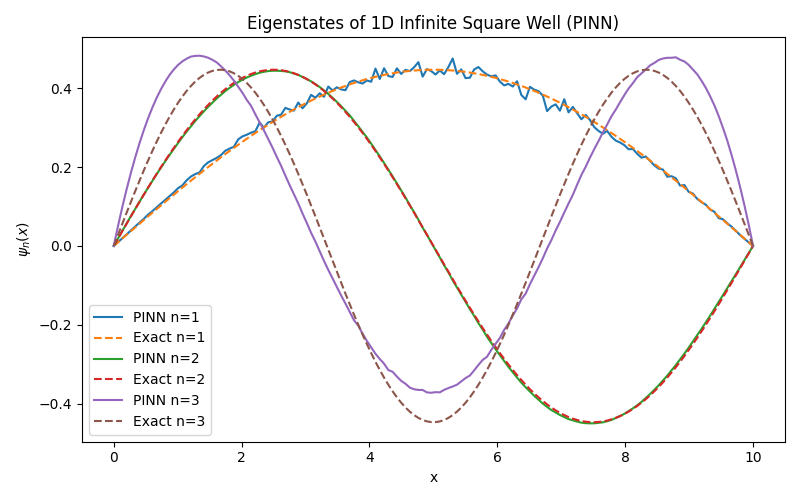

# Physics-Informed Neural Network (PINN) Solver for the Time-Independent Schrödinger Equation in Infinite Square Well

This project implements a **Physics-Informed Neural Network (PINN)** to solve the **1D Time-Independent Schrödinger Equation (TISE)** for an infinite square well potential.  
The neural network learns both the **wavefunction** and the corresponding **energy eigenvalue** by enforcing physical laws directly in the loss function, without any labeled training data.

---

## Problem Description

We consider the one-dimensional Time-Independent Schrödinger Equation:

$$
-\frac{\hbar^2}{2m}\frac{d^2 \psi(x)}{dx^2} + V(x)\psi(x) = E\psi(x)
$$

on the domain:

$$
x \in [0, L]
$$

with an infinite square well potential:

$$
V(x) =
\begin{cases}
0, & 0 < x < L \\
\infty, & \text{otherwise}
\end{cases}
$$

This imposes **Dirichlet boundary conditions**:

$$
\psi(0) = \psi(L) = 0
$$

The wavefunction must also satisfy the **normalization condition**:

$$
\int_0^L |\psi(x)|^2 \, dx = 1
$$

---

## Approach

Instead of using finite-difference or matrix diagonalization methods, this project uses a **Physics-Informed Neural Network**:

- A fully connected neural network represents the wavefunction $\psi_\theta(x)$
- Automatic differentiation (JAX) is used to compute first and second derivatives
- The energy $E$ is treated as a **trainable parameter**
- No training data is used; the network is trained purely by enforcing physics

### Analytical Reference (Exact Solution)
To validate the neural network's accuracy, we compare its predictions against the known analytical solutions for the particle in a box:

**Wavefunctions:**
$$\psi_n(x) = \sqrt{\frac{2}{L}} \sin\left(\frac{n\pi x}{L}\right)$$

**Energy Eigenvalues:**
$$E_n = \frac{n^2 \pi^2 \hbar^2}{2mL^2}$$

where $n = 1, 2, 3, \dots$ represents the quantum number.

---


## Requirements

To run this project, you will need the following Python packages:

* **Python** 3.10+
* **JAX** (with `jaxlib`)
* **Optax** (for optimization)
* **NumPy**
* **Matplotlib** (for plotting)

You can install the dependencies via pip:

```bash
pip install jax jaxlib optax numpy matplotlib
```

## How to run?
To run the file, simply execute in the root directory in terminal:
```bash
python run.py
```
or
```bash
python3 run.py
```
---

## Loss Function

The total loss is a weighted sum of three physically motivated terms.

### 1. Schrödinger Equation Residual

Enforces the TISE at collocation points inside the domain:

$$
\mathcal{L}_{PDE} =
\left\langle
\left(
-\frac{1}{2}\psi''(x) - E\psi(x)
\right)^2
\right\rangle
$$

### 2. Boundary Condition Loss

Enforces the infinite potential walls:

$$
\mathcal{L}_{BC} =
|\psi(0)|^2 + |\psi(L)|^2
$$

### 3. Normalization Loss

Ensures unit probability:

$$
\mathcal{L}_{norm} =
\left(
\int_0^L |\psi(x)|^2 dx - 1
\right)^2
$$

The full objective function is:

$$
\mathcal{L} =
\lambda_{PDE}\mathcal{L}_{PDE}
+
\lambda_{BC}\mathcal{L}_{BC}
+
\lambda_{norm}\mathcal{L}_{norm}
$$

---

## Implementation Details

- Framework: JAX
- Activation function: `tanh` (smooth second derivatives)
- Optimizer: Gradient Descent
- Automatic differentiation is used for all spatial derivatives
- Dimensionless units are used for numerical stability:

$$
\hbar = m = 1
$$

---

## Results

The PINN successfully learns valid eigenfunctions of the infinite square well.

<div align="center">
  
</div>

### Diagnostics
```bash
n=1 | E_PINN = 0.049934 | E_exact = 0.049348
n=2 | E_PINN = 0.199889 | E_exact = 0.197392
n=3 | E_PINN = 0.436916 | E_exact = 0.444132

Overlaps ⟨ψ_n | ψ_m⟩:
<1|1> = 3.818e-02   <1|2> = 1.293e-02   <1|3> = 2.310e-03   
<2|1> = 1.293e-02   <2|2> = 4.073e+01   <2|3> = -5.766e-04   
<3|1> = 2.310e-03   <3|2> = -5.766e-04   <3|3> = 1.833e+00   

Node counts:
n=1 → nodes ≈ 2
n=2 → nodes ≈ 3
n=3 → nodes ≈ 4
```


### Insights from the Spectrum
* **High Fidelity for Lower Modes:** The PINN solutions for the ground state ($n=1$, blue) and first excited state ($n=2$, green) show excellent agreement with the exact analytical solutions (dashed lines).
* **Boundary Enforcement:** The hard constraints imposed by the network architecture ensure the wavefunction strictly vanishes at $x=0$ and $x=10$.
* **Higher Mode Difficulty:** For the second excited state ($n=3$, purple), the model captures the correct node structure and frequency. However, a slight amplitude deviation is visible compared to the exact solution (brown dashed), illustrating the increasing difficulty of optimizing for higher-frequency spatial oscillations.
* **Noise:** Minor fluctuations in the $n=1$ solution suggest that the optimization landscape is non-convex, though the overall physical shape is preserved.
